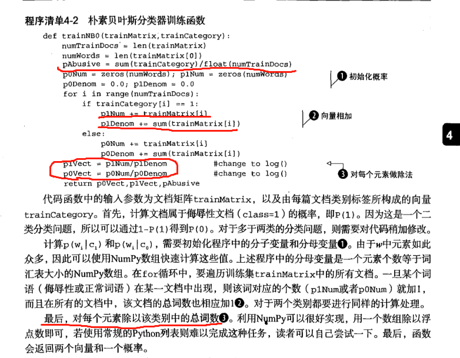

### 朴素贝叶斯
*最近阅读《机器学习实战》这本书中的朴素贝叶斯中的代码对一部分内容有点疑问，不知道是作者写错了还是我理解错了*



*作者计算条件概率的时候，对于一个文档来说他只统计词有没有出现，而没统计出现多少次，并且多项式模型平滑处理（后面改进但是平滑处理为什么加2？）
也要分母加上词典不同单词的总数。所以我把自己的认为正确的代码保存在这里以后再看*
---
* 计算公式：$p(c_i|w) = \frac{p(w|c_i)p(c_i)}{p(w)}$
* 其中分母 p(w) 在计算的时候都相同，所以只需要计算分子 $p(w|c_i)p(c_i)$
* 条件概率 $p(w|c_i) = p(w_0|c_i)p(w_1|c_i)...p(w_n|c_i)$

#### 多项式模式模型
* 多项式模型以词为粒度
* 先验概率 $P(c_i) = \frac{类c_i下文档总数}{所有训练样本的文档总数}$(两者相同)
* 条件概率 $p(w_j|c_i) = \frac{类c_i下单词w_j在所有文档中出现过的次数之和+1}{类c_i下单词总数+m}$
``
其中m是词表的长度，也就是总训练样本中所有不重复单词的数量
``

#### 伯努利模型
* 伯努利模型以文件为粒度
* 先验概率 $P(c_i) = \frac{类c_i下文档总数}{所有训练样本的文档总数}$(两者相同)
* 条件概率 $p(w_j|c_i) = \frac{类c_i下包含单词w_j的文档数+1}{类c_i下文档总数+n}$
``
其中n是类别数量，也就是我们训练样本一共有多少种不同的类别
``

#### 举个例子
编号|文档|类别(love?)
---|:--:|:---:
1|I love china|yes
2|china is beautiful|yes
3|china china love|yes
4|stupid china|no
5|bad china|no
```
词典 {I, love, china, is, beautiful, stupid, bad} 
测试文档  china china love stupid
```
---
* 多项式模式模型

$p(yes) = \frac{3}{5}$ &emsp; &emsp; $p(no) = \frac{2}{5}$ 

$p(china|yes) = \frac{4+1}{9+7} = \frac{5}{16}$ &emsp; $p(love|yes) = \frac{2+1}{9+7} = \frac{3}{16}$ &emsp; $p(stupid|yes) = \frac{0+1}{9+7} = \frac{1}{16}$ 

$p(china|no) = \frac{2+1}{4+7} = \frac{3}{11}$ &emsp; $p(love|no) = \frac{0+1}{4+7} = \frac{1}{11}$ &emsp; $p(stupid|no) = \frac{1+1}{4+7} = \frac{2}{11}$

$p(yes|china &ensp; china &ensp; love &ensp; stupid) = \frac{3}{5} * (\frac{5}{16})^2 * \frac{3}{16} * \frac{1}{16} = 0.0006866$

$p(no|china &ensp; china &ensp; love &ensp; stupid) = \frac{2}{5} * (\frac{3}{11})^2 * \frac{1}{11} * \frac{2}{11} = 0.0004917$

故该文档属于yes

---
* 伯努利模型

$p(yes) = \frac{3}{5}$ &emsp; &emsp; $p(no) = \frac{2}{5}$ 

$p(china|yes) = \frac{3+1}{3+2} = \frac{4}{5}$ &emsp; $p(love|yes) = \frac{2+1}{3+2} = \frac{3}{5}$ &emsp; $p(stupid|yes) = \frac{0+1}{3+2} = \frac{1}{5}$

$p(china|no) = \frac{2+1}{2+2} = \frac{3}{4}$ &emsp; $p(love|no) = \frac{0+1}{2+2} = \frac{1}{4}$ &emsp; $p(stupid|no) = \frac{1+1}{2+2} = \frac{2}{4}$

$p(yes|china &ensp; china &ensp; love &ensp; stupid) = \frac{3}{5} * (\frac{4}{5})^2 * \frac{3}{5} * \frac{1}{5} = 0.04608$

$p(no|china &ensp; china &ensp; love &ensp; stupid) = \frac{2}{5} * (\frac{3}{4})^2 * \frac{1}{4} * \frac{2}{4} = 0.028125$

故该文档属于yes